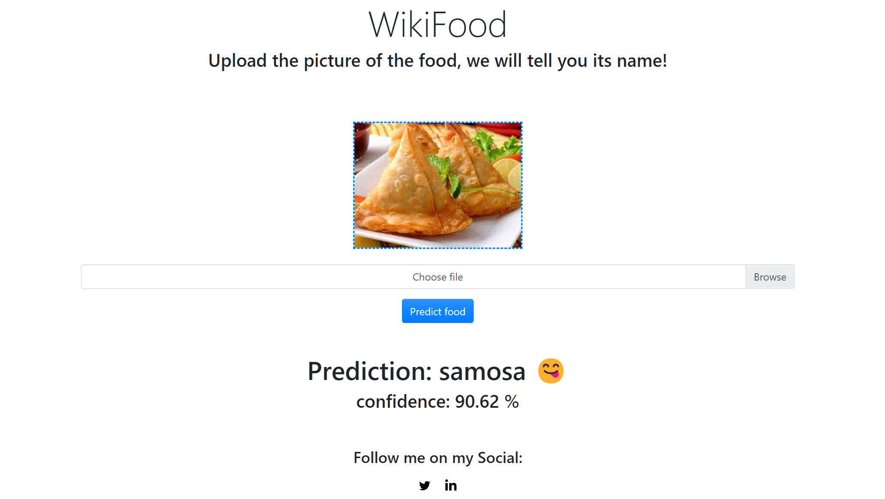

# Food Detection Model

This is a personal AI project that focuses on detecting various types of food. The model was trained on the [101_food dataset](https://www.kaggle.com/datasets/dansbecker/food-101) and fine-tuned using the [EfficientNetB0](https://www.tensorflow.org/api_docs/python/tf/keras/applications/efficientnet/EfficientNetB0) model in TensorFlow. The final model achieved an accuracy of 77.80%.

## Goal

The aim of this project is to create a user-friendly Flask application with a simple UI to allow users to upload images of food and receive predictions about what type of food is in the image.

## Project Structure

- `model.h5`: This file contains the trained food detection model.
- `app.py`: The Flask application code.
- `templates/index.html`: HTML template for the UI.
- `static/css/style.css`: CSS file for styling.
- `static/js/script.js`: JavaScript file for handling image uploads and predictions.

## Running the Application

1. Ensure you have Python and the required libraries installed. You can install the necessary libraries using `pip install -r requirements.txt`.
2. Run `app.py` using `python app.py`.
3. Visit `http://localhost:5000` in your web browser.

## Usage

1. Open the application in your web browser.
2. Upload an image of food using the provided button.
3. Click the "Predict food" button.
4. The application will display the predicted food type.

## Model Details

- Input Shape: (224, 224, 3)
- Model Architecture: EfficientNetB0
- Training Accuracy: 77.80%

## Acknowledgments

- [101_food dataset](https://www.kaggle.com/datasets/dansbecker/food-101)
- [EfficientNet](https://www.tensorflow.org/api_docs/python/tf/keras/applications/efficientnet/EfficientNetB0)

## License

This project is licensed under the [MIT License](LICENSE).

Feel free to contribute, report issues, or suggest improvements!
